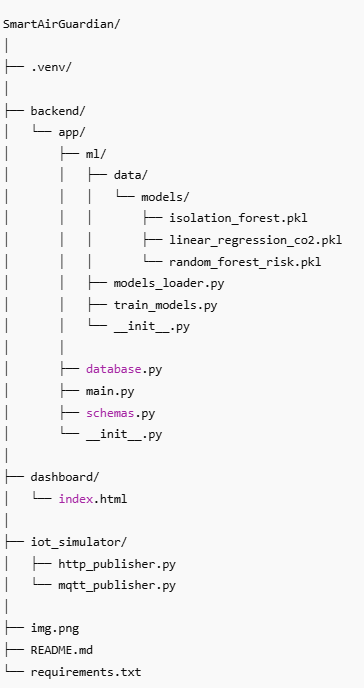

# 🌱 SmartAir Guardian  
### Plataforma Inteligente de Monitoramento da Qualidade do Ar utilizando IoT + IA

O **SmartAir Guardian** é uma solução integrada de **Internet das Coisas**, **Big Data** e **Inteligência Artificial**, desenvolvida como projeto final da disciplina *IoT e IA Aplicada*.  
O sistema monitora a qualidade do ar em tempo real utilizando sensores simulados (ou reais) e aplica modelos de IA para:

- Detectar anomalias ambientais  
- Classificar níveis de risco  
- Prever tendências de concentração de CO₂  

O projeto demonstra o ciclo completo de uma solução IoT moderna, combinando **coleta**, **processamento**, **persistência**, **análise** e **visualização**.

---

# 📌 Sumário

- [Arquitetura](#-arquitetura-da-solução)
- [Tecnologias](#-tecnologias-utilizadas)
- [Estrutura do Repositório](#-estrutura-do-repositório)
- [Instalação](#-instalação-e-configuração)
- [Ambiente Virtual](#criar-ambiente-virtual-opcional)
- [Instalar Dependências](#instalar-dependências)
- [Treinar os Modelos de IA](#-treinando-os-modelos-de-ia)
- [Executando a API](#-executando-a-api-fastapi)
- [Simulador IoT](#-rodando-o-simulador-iot)
- [Dashboard Web](#-dashboard-web)
- [Testes com Swagger](#-testando-a-api-pelo-swagger)
- [Equipe](#-equipe)
- 
----

# 🏗 Arquitetura da Solução

A arquitetura foi construída para simular um fluxo IoT completo:


### Fluxo:

1. **Simulador IoT** gera leituras de CO₂, PM2.5, temperatura e umidade.  
2. Envia os dados pelo endpoint `/ingest`.  
3. A **API FastAPI** armazena e processa as leituras.  
4. O módulo de **IA** aplica:
   - Isolation Forest → detecção de anomalias  
   - Random Forest → classificação de risco  
   - Regressão Linear → previsão de CO₂ futuro  
5. O **Dashboard Web** consulta as últimas leituras e exibe em gráficos.

---

# 🧪 Tecnologias Utilizadas

### Backend
- **FastAPI**
- **Python 3.10+**
- **Uvicorn**
- **Pydantic**

### Machine Learning
- **scikit-learn**
- Isolation Forest  
- Random Forest  
- Regressão Linear  

### IoT Simulado
- **Python + requests**
- Publicação periódica para a API

### Dashboard
- HTML + CSS  
- **Chart.js**  
- JavaScript puro (fetch API)

---

# 📁 Estrutura do Repositório




---

# ⚙ Instalação e Configuração

### Criar ambiente virtual (opcional)
```bash
python -m venv venv
```
### Instalar dependências
```bash
pip install -r requirements.txt
```
### 🤖 Treinando os Modelos de IA
```bash
python backend/app/ml/train_models.py
```
### 🚀 Executando a API FastAPI
```bash
uvicorn backend.app.main:app --reload
```
Acesse:
📌 Swagger: http://127.0.0.1:8000/docs
📌 Status: http://127.0.0.1:8000/
### 📡 Rodando o Simulador IoT
```bash
python iot_simulator/http_publisher.py
```
### 🌐 Dashboard Web
Abra o arquivo:
dashboard/index.html
### 🧪 Testando a API pelo Swagger
No navegador:

👉 http://127.0.0.1:8000/docs

Você poderá:

Enviar leituras manualmente

Consultar as últimas medições

Ver como a IA classifica risco e detecta anomalias

---
# 👨‍💻 Equipe

Projeto desenvolvido por: Dionatan Carvalho

Curso: Inteligência Artificial Aplicada

Universidade: Unisinos